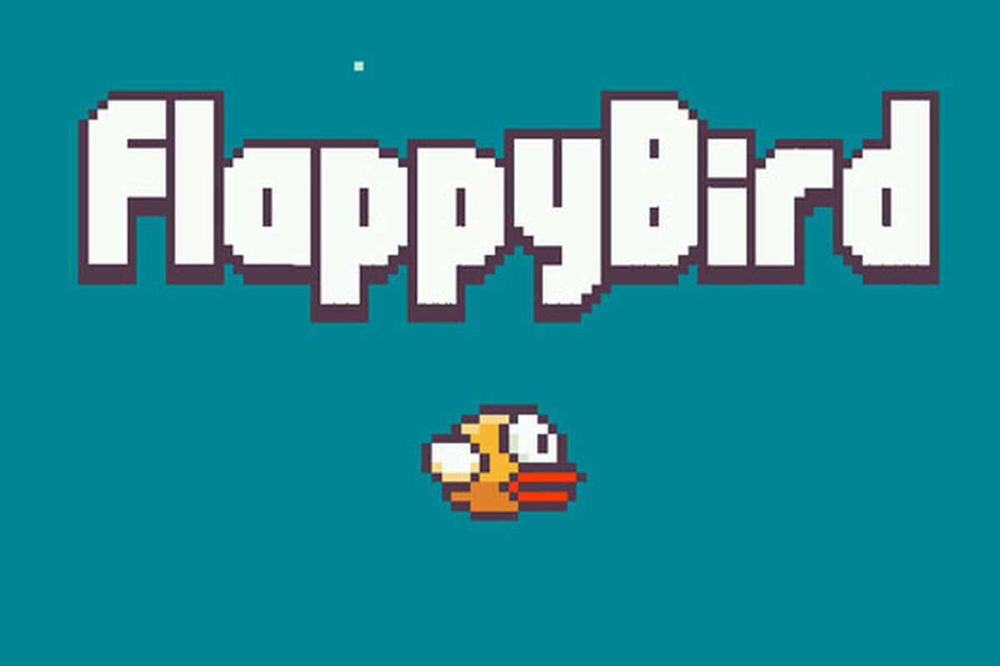

# Flappy Bird with Web3 Integration

A simple Flappy Bird game with the flavor of Web3.

## Description

Flappy Bird is a classic 2D game where you control a bird and navigate it through a series of pipes. In this version, we've added Web3 integration using the ThirdWEBsdk, allowing you to log in to your MetaMask wallet and enjoy the game with a blockchain twist.

## Features

- Classic Flappy Bird gameplay.
- Web3 integration using ThirdWEBsdk.
- Log in to your MetaMask wallet.
- Collect blockchain-based rewards.
- Endless fun!
